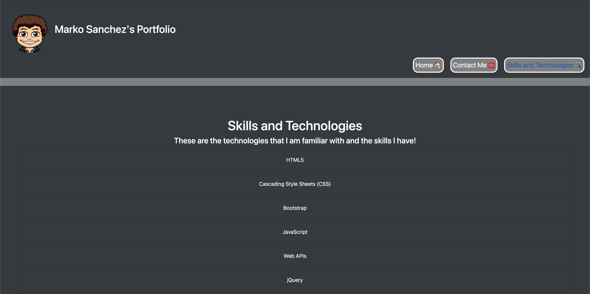

# Portfolio

## Site Image

## Deployed Site
[Site](https://markosportfolio.herokuapp.com/)

## Summary
This is a portfolio entailing all the important information about myself such as my most important and detailed projects, links to get in contact with me, a list of my skills and knowledgeable topics, and a downloadable copy of my resume. I utilized Bootstrap CSS to create the styling and some custom CSS as well for the aesthetics of the page, then the Handlebars templating engine for all the viewable content on the site.  Express and Sequelize were used for all the routing to move between the different pages on the site and creating all the data necessary to be viewed.

## Technologies Used
- CSS - Deeper styling such as colors, borders, and highlights for certain elements
- Bootstrap - Used for the makeup of the page elements such as the info cards and the navigation links located in the header
- Handlebars - Used to create the frame of the site, all the cards necessary to hold content, and the partials for my projects
- MySQL - Used as the database to hold the sites information
- Express - Used to create all the routes for pulling different content on the site
- Sequelize - Used to create the model used and control what happens with that content
- dotenv - Used to hide sensitive content

### Author Links
- [LinkedIn] (https://www.linkedin.com/in/marko-sanchez-800)
- [GitHub] (https://github.com/markosanchez800)